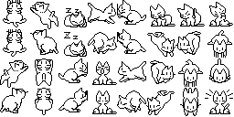
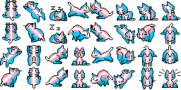
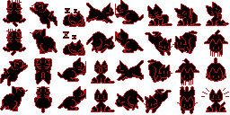
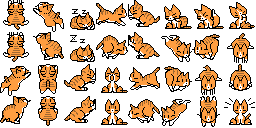
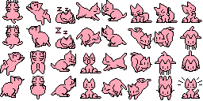

# oneko.js

Yay! Cat on a website. She runs, sleeps and does other stuff, yay! (real cat)
Small little pixel cat that follows your cursor. You can also click on it and some heart come off the cat.
I added different textures and I searched for a way to change the textures on the site with a dropdown.
So now you can change the Textures of the cat with a dropdown.

You can also see a little demo of the dropdown and the cat on [my site](https://luna-uwu.nekoweb.org/).

Here are all the textures of the Cats:

## OG Cat

## Trans Cat

## Black - Red Texture Cat

## Orange Cat

## Pink Cat


You can also make your own just download any of cats and change the texture yourself. Originally that's what I did I just had the desire to have a trans textured cat.

but now you can also add the dropdown and this small js snippet to your html file and the oneko.js file to your site then also you can this cat with a dropdown to change the texture.

### Dropdown **copy into HTML**
```
<label for="pet-select">Choose a pet:</label>

<select id="pet-select">
  <option value="">--Please choose a variation--</option>
  <option value="original">original</option>
  <option value="trans">trans</option>
  <option value="black-red">anarchy</option>
  <option value="orange">orange</option>
  <option value="pink">pink</option>
</select>
```


### Eventlistener to dropdown **copy into HTML**
This is the Eventlistener to the dropdown. I also put this in the html directly. Ideally I would also like to put that in the same oneko.js as the other stuff. But I don't know how to do that *yet*.
Also in your HTML you can put in this script so it can read the dropdown and in the last line
`loadOneko("trans");` you can change out Trans for whatever you would like to be your starting cat to be.
```
<script>
  function loadOneko(cat) {
    document.getElementById("oneko")?.remove();
    document.getElementById("oneko-script")?.remove();

    const script = document.createElement("script");
    script.id = "oneko-script";
    script.src = "./oneko.js";
    script.dataset.cat = cat || "original";
    document.body.appendChild(script);
  }

  document.getElementById("pet-select").addEventListener("change", function () {
    loadOneko(this.value);
  });

  // Set the starting cat
  loadOneko("trans");
</script>
```

| Cats | Description | Value |
| -------- | -------- | -------- |
| Original Cat | OG cato | original |
| Trans Cat | Trans Texture | trans |
| Anarchy Cat | Black-red Texture | anarchy |
| Orange Cat | Orange cat energy | orange |
| Pink Cat | Pink Texture | pink |

I also plan to add more cats in the future that is something I'm already working on. (I'm currently working on a cat that belongs to a friend :3 )

If you want you can send me an [E-Mail](mailto:mail@faye.moe) with your textures and I will add it to the folder (or you could do it on your own -- I'm not sure how Github totally works yet)

Anyways thanks for checking out this repository !!!

---

Original author: https://adryd.com

The Fork I used / cloned: https://github.com/tylxr59/oneko.js/

implemented in a few different places
- https://luna-uwu.neocities.org/ -- my own neocities webpage yayy

All the programming and smart people stuff was done by https://adryd.com and https://github.com/tylxr59 (they also have a very cool page which you can find here: https://tylxr.com/)
